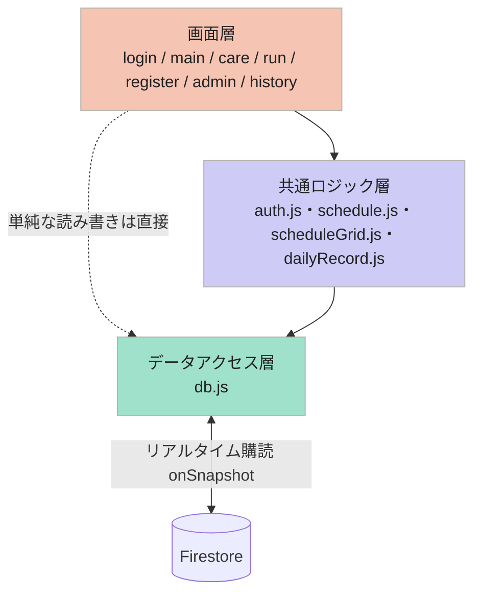
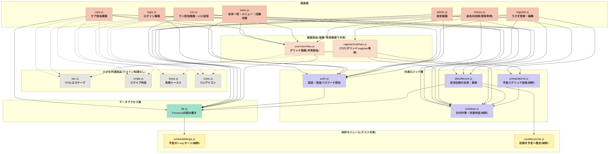

# うさぎホテル業務管理アプリ

**アルバイト先（うさぎホテル2店舗）で実際に運用中の業務管理アプリ**。紙とLINEでの伝達に頼っていた
ケア/ラン担当のチェック管理・飼い主へのLINE送信管理・宿泊予定の登録を、個人で設計からデプロイまで行って置き換えた。

- 🔄 **リアルタイム同期**：Firestoreのリアルタイム購読で、あるスタッフの操作が他のスタッフの画面にページ再読み込みなしで即座に反映される（[仕組み](#仕組みアーキテクチャ)参照）
- 🔒 **同時編集に強い書き込み設計**：フィールド単位マージ・`arrayUnion`/`arrayRemove`・3-wayマージを操作ごとに使い分け、複数人が同時に触っても記録が壊れない
- ✅ **テスト・CI**：Firestoreに依存しないロジックを純粋関数として切り出し、49件のユニットテストをGitHub Actionsで自動実行
- 🔐 **実運用を意識したセキュリティ**：Firebase Authentication + Firestoreセキュリティルール + App Check（reCAPTCHA Enterprise）
- 🗑️ **自動データライフサイクル管理**：Firestore TTLで宿泊終了から6ヶ月後にデータを自動削除し、手動でのバックアップ・削除運用を不要に

---

`documents/` の設計資料に基づく実装です。Firebase(Sparkプラン)+ Hosting + Firestore + メール/パスワード認証で動きます。

実際に自分のアルバイト先(うさぎホテル2店舗)の日々の業務(ケア・ラン担当のチェック、飼い主へのLINE送信管理、宿泊予定の登録)を
置き換えるために作った実務ツールです。汎用の多店舗SaaSではなく、店舗数(`store_1`/`store_2`)は
`public/firebase-config.js` の `STORES` 配列に直接書く設計にしています(店舗を管理画面から増減する機能はありません。
増やす場合は配列を編集し、Firestoreに `stores/{storeId}` を1件追加します)。

## 機能

スタッフはパスワードを1つ入力してログイン(共有アカウント)し、上部メニューから担当画面を選んで使う。

- **全体一覧**（`main.html`）：今日から1週間ぶんを、日付×うさぎの表で一覧表示。ケア/ラン/写真をそれぞれ
  予定〇・一部実施◐・完了●で色分け表示する。右上の「＋」からうさぎ登録へ、上部で店舗（本店／豊中店）を切替。
- **ケア担当**（`care.html`）：うさぎごとにケア項目をチェック。当日だけ項目を追加/削除もできる（ケア項目マスタや
  他の日の予定には影響しない）。全項目チェック済みになったら、カードを左スワイプして「ケア完了」を確定する。
- **ラン担当**（`run.html`）：ラン回数のチェック、写真の撮影/送信管理に加えて、**ケア・ラン両方の「LINE送信済み」操作もここに集約**
  されている（誤操作を防ぐため、送信済みにする操作だけスワイプ）。
- **うさぎ登録**（`register.html`）：飼い主情報・宿泊期間・送迎の有無を入力後(STEP1)、ケア/ランの予定を滞在期間の
  グリッドで確認・調整して保存する(STEP2)。ケア日は「お迎え日の前日」（定休日なら直近の営業日）を自動算出。
  既存うさぎの編集や、宿泊終了(非表示化)もここから行う。
- **過去の記録**（`history.html`）：宿泊が終わったうさぎだけを月ごとに、全体一覧と同じ表で閲覧する（編集不可）。
- **設定**（`admin.html`）：ケア項目マスタ・定休日・繁忙期を編集(自動保存)。開くときに別途「設定パスワード」を要求する。

**誰かの操作が他のスタッフの画面にも自動で反映される**のがこのアプリの核。たとえばケア担当がチェックを入れると、
同じFirestoreの文書を購読しているラン担当・全体一覧の画面にも、ページの再読み込みなしで即座に反映される。

## 仕組み（アーキテクチャ）

大きくは4段の一方向の流れです。画面層は基本的に共通ロジック層を経由しますが、複雑な計算が要らない単純な
読み書き（一覧の購読など）は画面層からデータアクセス層(`db.js`)を直接呼ぶこともあります。



ファイル単位でもっと細かく見ると、実際には「画面部品」（`overviewView.js`など複数画面が共用する描画部品）や
「小さな共通部品」（`esc.js`/`swipe.js`など、業務知識を持たない汎用ユーティリティ）も存在します。
その全ファイルの依存関係は次の図のとおりです（色は上の3層に対応。実線＝業務ロジックの本流、
点線＝汎用ユーティリティへの呼び出し）。



- **「予定」と「実績」を分けて持つ**：登録時に決めた`careSchedule`/`runSchedule`（予定）と、その日の
  実施・送信済み状況を持つ`dailyRecords`（実績）は別フィールド。まだ来ていない未来の日は予定を、
  今日・過去の日は実績を見て表示する。この判定は`schedule.js`の`careOnDate()`/`runOnDate()`に一本化されていて、
  どの画面もこの2関数の結果だけを見る（表示ロジックの重複がない）。
- **同時編集に強い書き込み**：複数のスタッフが同時に操作しても記録が壊れたり重複作成されたりしないよう、
  操作の種類ごとに書き込み方を分けている。
  - チェックなど実施記録の更新 → フィールド単位のマージ書き込み（`setDoc(..., {merge:true})`）
  - その日だけの項目追加/削除 → `arrayUnion`/`arrayRemove`
  - 登録画面での宿泊予定の保存 → `runTransaction`内で「利用者が変えた日だけ」を書く3-wayマージ
    （他端末が別の日を変えていても上書きしない）
- **Firestoreに依存しない部分はテスト可能な純粋関数として分離**：日付計算・状態判定・予定の変換ロジック
  （`schedule.js` / `scheduleGrid.js` / `scheduleMerge.js` / `careReconcile.js`）はDOM/Firestoreを一切触らず、
  `tests/`でNode標準のテストランナーによりテストしている（`npm test`、49件）。GitHub Actionsで
  push・PRのたびに自動実行される（`.github/workflows/ci.yml`）。

より詳しい関数一覧・呼び出し関係は `documents/function_relationships.md`、機能ごとの処理の流れは
`documents/feature_to_function_mapping.md` を参照。

## ファイル構成

機能ごとの動きは上の「機能」「仕組み」を参照。ここはファイルの場所と役割だけの索引。

```
public/                 … Hosting で配信するファイル
  index.html                    … login.html へリダイレクトするだけ
  login.html / login.js         … ログイン画面
  main.html / main.js           … 全体一覧画面(overviewView.js を埋め込み)
  care.html / care.js           … ケア担当画面
  run.html / run.js             … ラン担当画面
  overviewView.js               … 全体一覧・過去の記録で共用するグリッド描画部品
  register.html / register.js   … うさぎ登録・編集画面
  registerGridView.js           … register.js STEP2のグリッドHTML生成部品
  history.html / history.js     … 過去の記録参照画面
  admin.html / admin.js         … 設定画面

  firebase-config.js … Firebase接続設定 + STAFF_EMAIL + App Check(★要編集。gitignore対象。
                        firebase-config.example.js をコピーして作る)
  firebase-config.example.js … 上記のテンプレート(実際の値はダミー。こちらだけgit管理)
  vendor.js          … Firebase SDK の唯一の入口(バージョン更新はこのファイルだけ)
  auth.js            … 共通ロジック層:スタッフ共有アカウントのログイン + 設定パスワード照合
  schedule.js        … 共通ロジック層:日付計算・その日の状態(careOnDate / runOnDate)
  dailyRecord.js     … 共通ロジック層:当日記録の生成・更新
  careReconcile.js   … 純粋ロジック:当日記録を予定へ合わせる(dailyRecord.js から使用・テスト対象)
  scheduleMerge.js   … 純粋ロジック:予定の3-wayマージ判定(db.js から使用・テスト対象)
  scheduleGrid.js    … 純粋ロジック:登録STEP2の作業データ ↔ Firestore形式(テスト対象)
  db.js              … データアクセス層:Firestoreの読み書き
  esc.js / swipe.js / toast.js … 小さな共通部品(HTMLエスケープ / スワイプ完了 / 失敗トースト)
  icons.js / icons/*.svg … アイコン(個別のSVGファイルをCSSのmaskで表示。JS生成部分用の icon() ヘルパー)
  style.css          … 全画面共通デザイン

firebase.json / firestore.rules / firestore.indexes.json / .firebaserc
package.json / eslint.config.js / .prettierrc.json … 開発ツール(npm run check)
tests/ … 純粋ロジックのテスト(node --test)
```

## セットアップ手順

1. [Firebase コンソール](https://console.firebase.google.com/) でプロジェクトを作成(Sparkプランのまま)。
2. **Authentication** →「ログイン方法」→ **メール/パスワード** を有効化（匿名は使わない）。
   続いて **Users** →「ユーザーを追加」で**スタッフ共有アカウントを1つ**作成する
   （例：`staff@あなたのドメイン`。パスワードがスタッフ全員のログインパスワードになる）。
3. **Firestore Database** を作成(本番モード)。
4. `cp public/firebase-config.example.js public/firebase-config.js` でテンプレートをコピー
   （`firebase-config.js` は `.gitignore` 対象。実際の接続情報をgit管理に入れないため）。
   ウェブアプリを追加し、表示された設定値を `public/firebase-config.js` の `firebaseConfig` に貼り付け。
   同ファイルの **`STAFF_EMAIL`** を手順2で作ったアドレスに変更。
   `.firebaserc` の `projects.default` も実際のプロジェクトIDに変更。
5. Firebase CLI を導入して初回デプロイ:
   ```
   npm install -g firebase-tools
   firebase login
   firebase deploy --only firestore:rules,hosting
   ```
6. 初期データはアプリの画面からではなく、**Firestoreコンソールの「＋ドキュメントを追加」から手で作成**する(下記「Firestore データ構造」の形どおり)。
   - `config/common`(ドキュメントID固定 `common`)に文字列フィールド `managerPassword` を1つ作成。設定画面(`admin.html`)を開くときのパスワードになる。
   - `stores/{storeId}`(`storeId` は `public/firebase-config.js` の `STORES` に書いた値。既定は `store_1` / `store_2`)を店舗の数だけ作成し、`name` / `holidays` / `careItemsMaster` / `busyPeriods` を入力する。
     店舗を増減するときは `STORES` 配列を編集し、この手順で `stores/{storeId}` を作り直す(このアプリは特定の職場の店舗数を前提にした作りで、管理画面から店舗を増減する機能は無い)。
7. **Firestore TTL** を設定:コンソール → Firestore →「TTL」→ コレクショングループID `rabbits`、フィールド `expireAt` でポリシーを有効化。
   既存データが無くても設定できる(宿泊終了[非表示]から6ヶ月後にうさぎ文書ごと自動削除される。追加のプログラムは不要)。
   - `expireAt` は `Timestamp` 型で保存される(`db.js` の `hideRabbit()`)。文字列だとTTLが機能しないため変更しないこと。
   - TTLは期限到達後すぐには削除されず、**最大72時間程度のタイムラグ**がある(Firestoreの仕様。即座に消えなくても異常ではない)。
8. `/login.html` からログイン。`main.html`(担当選択)の上部で本店／豊中店を切り替えられます
   (選択は端末ごとに `localStorage` に保存され、切替時にページが再読み込みされて全画面へ反映されます)。

以降の変更方法:
- **スタッフのログインパスワード** … 設定画面（`admin.html`）の「ログインパスワード」で、
  今のパスワードを入れて変更できる（店長が自分で変えられる）。
  うまくいかないとき / 今のパスワードが分からないときの予備手段：
  Firebase コンソール → Authentication → Users → 該当アカウント → パスワードを再設定（メールが届く）。
- **設定パスワード（managerPassword）** … Firestore コンソールで `config/common` を直接編集
  (セキュリティルールでクライアントからの更新を禁止しているため)。

### 引き継ぎ（共有アカウントのメールアドレスを変える）

開発時は開発者自身のメールで共有アカウントを作り、運用に渡すときに店が管理できる
アドレス（店長のメール、または店専用に作った Gmail）へ切り替える。データには一切影響しない
（アプリはログインユーザーのUIDを使っていない）。

1. Firebase コンソール → Authentication → Users で**新しいメールアドレスのユーザーを作成**
   （パスワードは運用で使う本番パスワード）。
2. `public/firebase-config.js` の `STAFF_EMAIL` を新しいアドレスに書き換える。
3. `firebase deploy --only hosting` でデプロイ。
4. 動作確認できたら、古いメールのユーザーを Authentication から削除。

※ `STAFF_EMAIL` はログインの最初に必要なため、設定画面（ログイン後にしか開けない）からは
変えられない。この1行の書き換え＋デプロイが引き継ぎ時の作業。

## セキュリティ

- **認証**：スタッフは Firebase Authentication の**共有アカウント1つ**（メール/パスワード）でログインする。
  `login.html` はパスワードだけを入力し、内部で `STAFF_EMAIL` 固定でサインインする。
  Firestore ルールはアクセス可否を「メール/パスワードでログイン済みか」(`sign_in_provider == 'password'`) だけで判定する
  （書き込み時は主要フィールドの型を軽く検証する程度で、詳しいスキーマ検証はしていない）。
  → デプロイURLを知っているだけでは読み書きできない（以前の匿名認証では誰でも通っていた）。
- **設定パスワード**：`config/common.managerPassword`。ログイン済みスタッフのみ読める。
  設定画面(`admin.html`)を開くときの2段階目の確認に使う（クライアント側で照合）。
- **App Check（推奨・任意）**：正規のWebアプリからのアクセスかを **reCAPTCHA Enterprise** で検証し、
  盗まれた設定値やスクリプトからの直接アクセスを弾く。
  （classic reCAPTCHA v3 は Google が Enterprise へ移行中のため、最初から Enterprise を使う。
  Enterprise は月1万アセスメントまで無料。このプロジェクトは TTL 利用で Blaze なので追加の課金設定は不要）
  設定手順：
  1. Firebase コンソール → **App Check** → アプリを登録 → **reCAPTCHA Enterprise** を選択。
     案内に沿って **スコアベース（website / score-based）のサイトキー**を作成し、
     そのキーの許可ドメインに Hosting のドメイン（`*.web.app` / 独自ドメイン）を追加。
     キーIDを `public/firebase-config.js` の `RECAPTCHA_SITE_KEY` に貼る。
  2. デプロイして `login.html` を開き、コンソールの App Check 画面で**リクエストが検証済みとして届く**ことを確認。
     ローカル(`firebase serve`)で試す場合は、DevTools で `self.FIREBASE_APPCHECK_DEBUG_TOKEN = true`
     を実行 → コンソールに出るトークンを App Check → アプリ → **デバッグトークン**に登録。
  3. 検証済みリクエストが十分に届いていることを確認してから、
     App Check → **Cloud Firestore** の「適用」を**有効化**する（有効化前は未検証でも通る）。
  - `RECAPTCHA_SITE_KEY` が空文字の間は App Check は初期化されない（未設定でもアプリは動く）。
- **残るリスク**：スタッフ共有アカウントのパスワードを知る人は全データを読み書きできる。
  「誰がいつ変えたか」の監査ログはない。個人ごとの権限分離が必要になったら
  スタッフ個別アカウント＋manager カスタムクレームへ移行する（評価メモ #3 の案2）。

## Firestore データ構造

以下が現在の構造(最終形)。設計からの変更点・検討したが採用しなかった案は
`documents/firestore_data_structure_final.md` にまとめている。

```
config/common
  { managerPassword }          (設定画面の入口。スタッフのログインは Firebase Auth 側)

stores/{storeId}                     (storeId は firebase-config.js の STORES。store_1=本店 / store_2=豊中店)
  name: "本店" | "豊中店"              (表示用の店舗名)
  holidays: { weekdays: [0..6], dates: ["YYYY-MM-DD", ...] }
  careItemsMaster: [ { id, name, order, countable? }, ... ]   (countable=true の項目は回数式。設定画面の「回数」で指定)
  busyPeriods: [ { start: "YYYY-MM-DD", end: "YYYY-MM-DD" }, ... ]
                                     (繁忙期。期間中は全うさぎで写真「不要」。
                                      終了日が過ぎたものは設定画面を開いたとき自動削除)

  rabbits/{rabbitId}
    ownerLastName, rabbitName, groupId,
    checkInDate, checkOutDate,          ("YYYY-MM-DD")
    transportDropoff, transportPickup, isFirstTime, note,
    staffName,                         (担当スタッフ名。登録STEP2の最後で入力・必須。全体一覧/過去の記録のうさぎ名の下に「担当 ○○」で表示)
    createdAt, hiddenAt, expireAt,
    careSchedule:  { "YYYY-MM-DD": [itemId, ...] }
    careCounts:    { "YYYY-MM-DD": { itemId: 回数 } }   (careItemsMaster.countable の項目のみ。通常項目は持たない)
    runSchedule:   { "YYYY-MM-DD": 回数 }
    (photoSchedule は廃止。写真要否は当日記録の photo.needed と自動判定 calculatePhotoNeeded で決まる)
    dailyRecords:  { "YYYY-MM-DD": {
        care:  { items: { itemId: bool },              (通常項目)
                 counts: { itemId: { need, done } },   (回数式項目)
                 allDone: bool, lineSent: bool },
        run:   { needed: n, doneCount: n, sentCount: n },
        photo: { needed: bool, taken: bool, sent: bool }
    } }
```

`dailyRecords` は設計資料の指示どおり**サブコレクションではなくうさぎ文書内のフィールド**です
(6ヶ月後のTTL自動削除で消し残りが起きないように)。

## 設計資料からの差分(実装上の判断)

| 箇所 | 資料 | 実装 | 理由 |
|---|---|---|---|
| ケア項目 | `careItemsMaster` サブコレクション | 店舗文書内の**配列フィールド** | 設定画面で「まとめて編集」するため、配列の方が読み書きが1回で済み無料枠に優しい |
| 定休日 | 「定休日リスト」 | `{ weekdays, dates }` | 毎週の定休曜日と臨時休業日の両方を扱えるように |
| うさぎ一覧の取得 | 資料は `subscribeRabbit`(単体)のみ記載 | 全体一覧=`subscribeActiveRabbits`(hiddenAt==null)／ケア・ラン=`subscribeAllRabbits`(終了ぶんも)／過去の記録=`getAllRabbits`→`isStayEnded`で絞る | 宿泊終了しても、その滞在期間の日付にはケア/ラン担当で記録が残って見えるように |
| 「宿泊終了」の判定 | 資料は明記なし | `schedule.isStayEnded(r)`＝`hiddenAt`あり **or** お迎え日<今日（当日は除く） | 「宿泊終了」ボタンの押し忘れを日付で自動カバー。`hiddenAt` は別途 TTL(6ヶ月後削除)の起点なのでボタン運用は残す |
| スワイプ操作の範囲 | 全操作をスワイプ | **完了確定・LINE送信済みにする操作だけ**スワイプ(`swipe.js`)。項目の追加/削除・回数の増減・チェックは誤操作防止のためボタン/チェックボックス | 取り消しにくい操作(送信済みにする等)だけをスワイプにし、日常的に触る操作は確実な形にするため。呼ぶ関数(`markCareLineSent` 等)は資料どおり |
| `getOrCreateDailyRecord` の引数 | `(rabbitId, date)` | `(storeId, rabbit, date, holidays, busyPeriods, countableIds)` | 購読中の文書と店舗設定を渡して読み取り回数を減らすため |
| `overview` での記録生成 | 資料では一覧でも `getOrCreateDailyRecord` | 一覧では**生成せず参照のみ** | 未来日の記録を先に作らないため。生成はケア/ラン画面で当日ぶんのみ |
| `careTotals` / `runTotal` | 宿泊全体の累計を文書に持つ | **廃止**（2026-09） | どの画面も読んでおらず、チェック操作ごとに余計な書き込みが増える＋当日記録と非アトミックにズレる原因になっていた。累計が要るときは `dailyRecords` から集計する |

## データ層と同時アクセス対策

- **店舗設定**：`getStoreConfig()`(1回)／`subscribeStoreConfig()`(購読)で `careItemsMaster` / `holidays` / `busyPeriods` をまとめて扱う。ケア/ラン/全体一覧は購読なので設定画面の変更が即反映。
- **当日記録の更新**：すべて `db.writeDailyRecord()`(`setDoc` merge)。`getOrCreateDailyRecord()` は「無いときだけ初期値を merge」なので同時に開いても重複作成されない。予定を後から足したぶんも取り込む。
- **予定の書き込み**：
  - ケア担当「項目を編集」→ `db.patchScheduleDay()`（`arrayUnion`/`arrayRemove` で1項目単位）
  - 登録画面の保存 → `db.writeSchedulesMerge()`（`runTransaction` 内で base/server/next の3-wayマージ。利用者が変えた日だけを field path で書く）
- **登録画面**：`subscribeRabbit()` で最新を保持。保存後は影響した日の既存 `dailyRecords` を `reconcileDailyRecord()` で予定に合わせる。
- **残る割り切り**：同じうさぎ・同じ日を2人が同時に別内容へ編集した場合は最後の書き込みが勝つ（セマンティックな衝突のためトランザクションでも解決しない）。

詳細は `documents/function_relationships.md` を参照。

## 開発（テスト）

ビルドは不要。純粋ロジック（日付計算・予定の3-wayマージ・当日記録の整合）に
Node 標準のテストランナーでテストを用意している。

```
npm install       # 初回のみ（ESLint / Prettier）
npm test          # tests/ 以下を実行（Node 20+ が必要）
npm run lint      # ESLint
npm run format    # Prettier で整形
npm run check     # lint + format:check + test（CI と同じ）
```

テスト対象（いずれも Firestore に依存しない純粋関数）:

| ファイル | 内容 |
|---|---|
| `public/schedule.js` | 日付ユーティリティ、定休日・繁忙期判定、`careOnDate` / `runOnDate` / `calculatePhotoNeeded` |
| `public/scheduleGrid.js` | 登録STEP2の作業データ ↔ Firestore形式の変換、`buildEntry` |
| `public/registerGridView.js` | STEP2 グリッドのHTML生成（`scheduleTableHTML` / `careBreakdownHTML`） |
| `public/scheduleMerge.js` | `db.writeSchedulesMerge` の3-wayマージ判定（本体から切り出し） |
| `public/careReconcile.js` | `dailyRecord.js` の `reconcileCare` / `computeAllDone`（本体から切り出し） |
| `public/esc.js` | HTMLエスケープ |

`main` への push と Pull Request で GitHub Actions（`.github/workflows/ci.yml`）が
`npm run lint` / `npm run format:check` / `npm test` を実行する。

## ページ移動のもたつきについて

画面ごとに別HTML（MPA）なので、移動のたびに Firebase 一式を初期化し直す。軽減のため：

- 各HTMLの `<head>` に `preconnect`（gstatic / firestore / securetoken）と `modulepreload`（vendor.js）
- **App Check（reCAPTCHA Enterprise）はアイドル時に遅延初期化**（`firebase-config.js`）。
  reCAPTCHA スクリプトの読み込みが重く、毎ページの描画を待たせていたのを外した。
- `firebase.json`：HTML は `no-cache`（毎回最新）、**JS/CSS は `max-age=300`（5分キャッシュ）、SVG は `max-age=86400`（1日キャッシュ）**。
  作業中の画面移動でファイルを取り直さない。
  - デプロイした変更が端末に届くまで最大5分（運用開始後はほぼデプロイしない前提）。
  - **開発中にデプロイした変更をすぐ確認したいときはハード再読み込み**
    （スマホ：サイトのデータを削除／PC：Ctrl+Shift+R）。`firebase serve` やプレビューチャンネルは常に最新。
  - HTML と JS を同時に変えたデプロイの直後だけ、旧JS＋新HTMLで一時的にズレる可能性 → 再読み込みで解消。

完全に無くすには SPA 化（1ページ＋クライアントルーティング）が必要だが、規模的に見合わない。

## 本番に出す前の動作確認（プレビュー）

実データに影響を与えずに変更を確認したいとき、Firebase Hosting のプレビューチャンネルを使う
（同じプロジェクト・別URL・7日で自動失効。Spark でも可）:

```
firebase hosting:channel:deploy pr-xxx     # 一時URLが発行される
firebase hosting:channel:delete pr-xxx     # 手動で消すとき
```

一時URLは Firestore/Auth は本番と共有する（＝本番データを触る）点に注意。
データも完全に分けたい場合は、別の Firebase プロジェクトを作って `.firebaserc` に
エイリアス（`firebase use --add`）を足し、`firebase-config.js` を切り替える。
